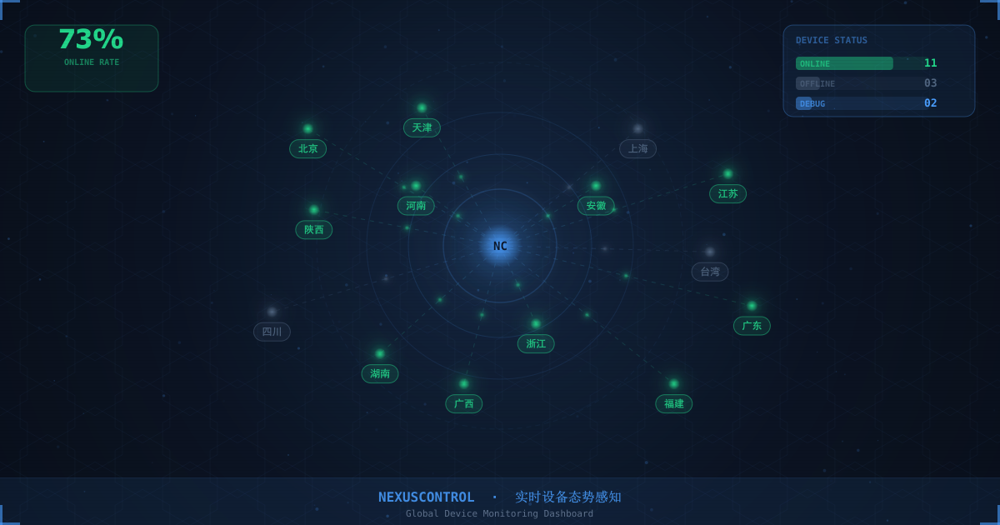
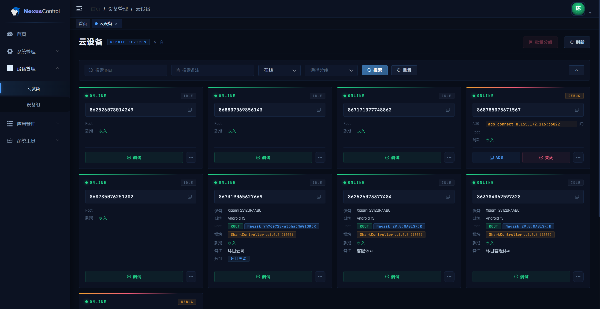
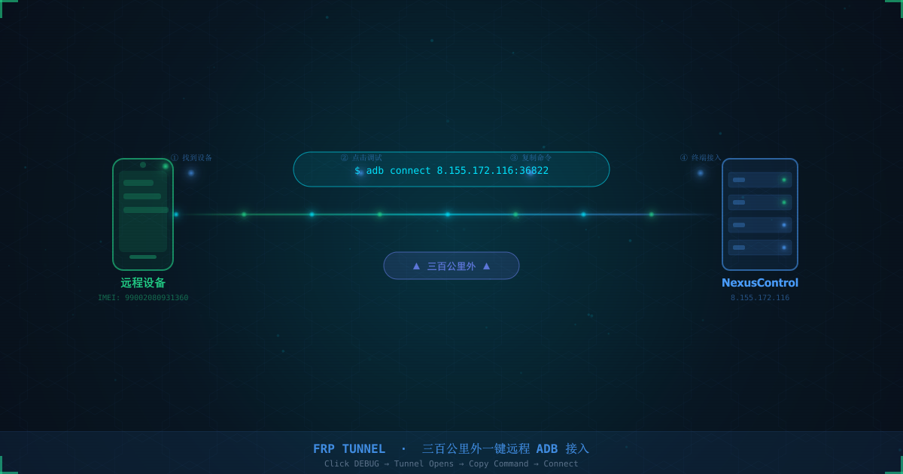
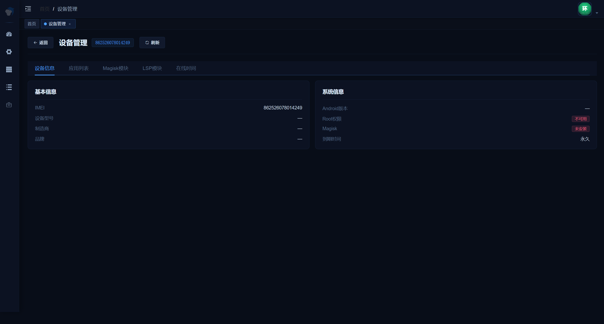
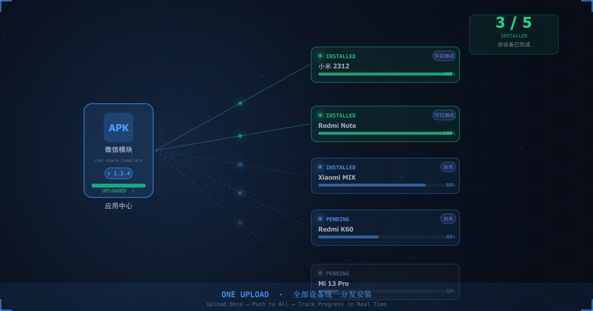
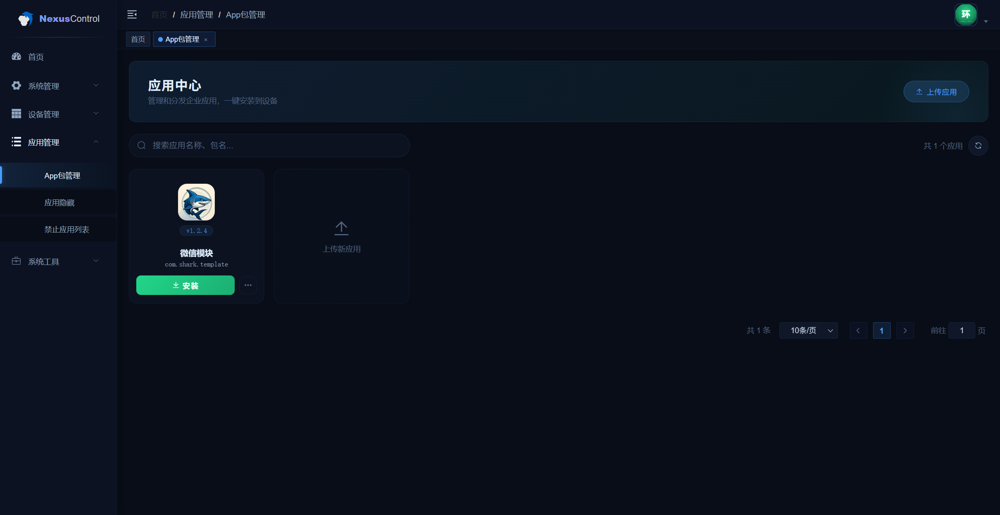
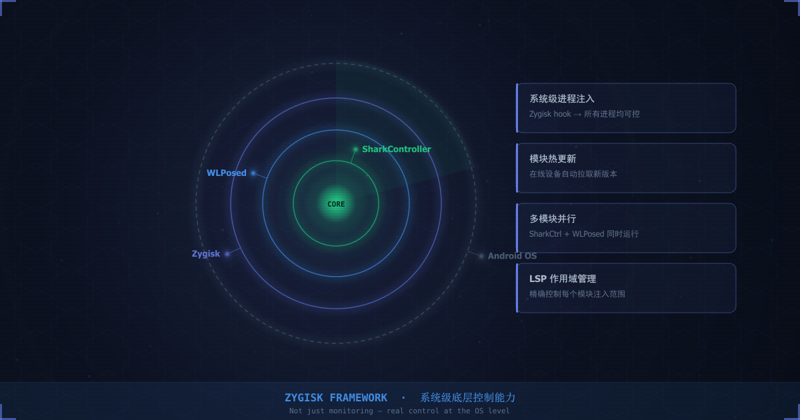

# NexusControl

**企业级 Android 云设备远程管理平台**

[官网](https://sharkposed.cn/) · [使用手册](docs/manual/NexusControl使用手册_v2.md) · [English](README_EN.md)

---

NexusControl 是一套面向企业的 Android 设备远程管理平台，提供设备状态监控、远程 ADB 调试、应用批量分发、Magisk 框架统一管理等功能，通过浏览器统一管控分散部署的 Android 设备。

---

## 核心功能

### 📡 设备看板

汇总所有设备的实时状态，绿色表示在线空闲、蓝色表示调试中、灰色表示离线。支持关键词搜索、设备组过滤，可在列表视图与卡片视图之间切换，也可批量选中设备进行分组操作。

---

### 🔧 远程调试

在设备卡片菜单中点击**调试**，平台自动建立 FRP 反向代理隧道，生成对应的 ADB 连接命令。将命令粘贴到本地终端即可建立 ADB 连接，支持 logcat 查看、文件推送、Shell 命令执行等操作。调试结束后点击**关闭调试**，隧道立即断开。

---

### 📦 应用分发

上传 APK 后平台自动解析应用名称、包名、版本号、版本代码，无需手动填写。可按单台设备或设备组批量下发安装指令。设备详情的**应用列表**标签页显示已安装应用及其版本，支持远程发送启动或重启指令。

---

### 🛡️ 框架管理

通过向设备端推送 Magisk 模块（SharkController、WLPosed、LSPosed）获得系统级控制能力。**核心管理**页面统一维护各模块版本，发布新版本后在线设备自动拉取，设备详情的 **Magisk 模块**和 **LSP 模块**标签页展示当前安装状态，支持远程安装与卸载。

---

### 📋 任务中心

每次批量操作（安装、启动、框架更新等）都会生成任务记录，可按批次查看整体到达率和完成率，也可按设备查看单台的执行结果。

---

## 设备端安装

NexusControl 通过在 Android 设备上安装 Magisk 模块来获得系统级管控能力。

### 设备前置条件

| 条件 | 要求 |
|------|------|
| Android 版本 | Android 10 及以上 |
| Root 框架 | 已安装 Magisk |

### 安装步骤

1. **安装 SharkController 模块**
   在 Magisk 中刷入 SharkController 模块包，重启设备使模块生效。

2. **扫码激活**
   设备重启后，通过平台管理后台生成激活二维码，使用设备扫描二维码完成设备注册，设备随即出现在云设备列表中。

3. **确认在线状态**
   回到平台**设备看板**，设备卡片显示绿色即表示连接成功。

---

## 联系我们

- 🌐 官网：[https://sharkposed.cn/](https://sharkposed.cn/)
- 📖 使用手册：[NexusControl使用手册_v2.md](docs/manual/NexusControl使用手册_v2.md)

如需了解更多或申请试用，欢迎通过官网与我们联系。
