# NexusControl 使用手册

> 版本：v2.0 · 适用读者：普通操作人员

---

## 目录

1. [产品概述](#1-产品概述)
2. [首页 · 设备看板](#2-首页--设备看板)
3. [设备管理](#3-设备管理)
   - 3.1 [云设备](#31-云设备)
   - 3.2 [设备组](#32-设备组)
4. [应用管理](#4-应用管理)
   - 4.1 [App 包管理](#41-app-包管理)
5. [系统管理](#5-系统管理)
   - 5.1 [核心管理](#51-核心管理)
   - 5.2 [任务中心](#52-任务中心)

---

## 1. 产品概述

**NexusControl** 是一套面向企业的 Android 远程设备管理平台，核心能力包括：

- **远程调试**：通过 FRP 内网穿透将设备 ADB 端口映射到服务器，操作人员可在任意网络环境下远程连接设备进行调试
- **应用分发**：统一管理 APK 安装包，一键推送安装到单台或多台设备；支持按设备组批量下发
- **框架管理**：集中管理设备端的 Magisk 模块（SharkController / LSPosed），支持远程发布新版本、查看模块状态与安装情况
- **设备管控**：支持远程启动/重启应用、开关安全模式、开关 ADB 网络，并可查看设备的在线时间记录
- **分组管理**：将设备划分为多个设备组，便于按组批量操作和策略下发
- **任务追踪**：所有下发指令均生成任务记录，可按批次或设备维度查看执行到达率和完成率

**菜单结构：**

| 一级菜单 | 子菜单 | 主要用途 |
|------|------|------|
| 首页 | 设备看板 | 实时查看设备总数、在线率、最新设备状态 |
| 设备管理 | 云设备 / 设备组 | 设备列表、ADB调试、卡片操作、分组管理 |
| 应用管理 | App包管理 | 上传 APK、推送安装到设备 |
| 系统管理 | 核心管理 / 任务中心 | 框架版本发布、任务执行记录查看 |

---

## 2. 首页 · 设备看板

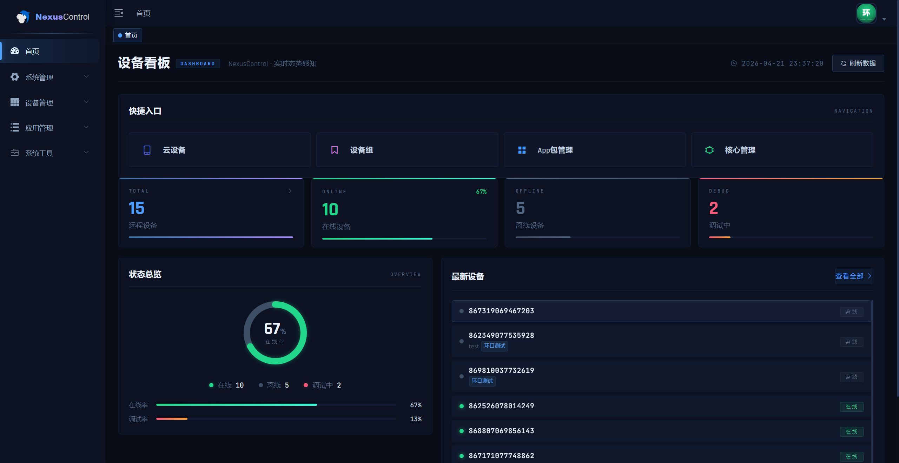

登录成功后默认进入 **设备看板**，可快速掌握当前所有设备的整体运行状态。

### 快捷入口

页面顶部提供 4 个常用功能一键直达入口：

| 入口 | 说明 |
|------|------|
| **云设备** | 跳转至云设备列表页 |
| **设备组** | 跳转至设备分组管理页 |
| **App包管理** | 跳转至应用中心 |
| **核心管理** | 跳转至核心框架管理页 |

### 数据统计卡片

快捷入口下方展示四个核心指标：

| 指标 | 说明 |
|------|------|
| **TOTAL** | 系统内远程设备总数，点击跳转至云设备列表 |
| **ONLINE** | 当前在线设备数及在线率百分比 |
| **OFFLINE** | 当前离线设备数 |
| **DEBUG** | 正在调试中的设备数 |

### 状态总览

左侧环形图直观显示设备在线率，下方列出在线 / 离线 / 调试中的精确数量及百分比，同时展示 **在线率** 和 **调试率** 两项指标。

### 最新设备

右侧列表展示最近接入系统的设备及其实时状态（在线 / 离线 / 调试中）。点击 **查看全部** 跳转至云设备列表页（默认筛选在线设备）。

### 操作按钮

- **刷新数据**：手动刷新看板所有数据

---

## 3. 设备管理

### 3.1 云设备

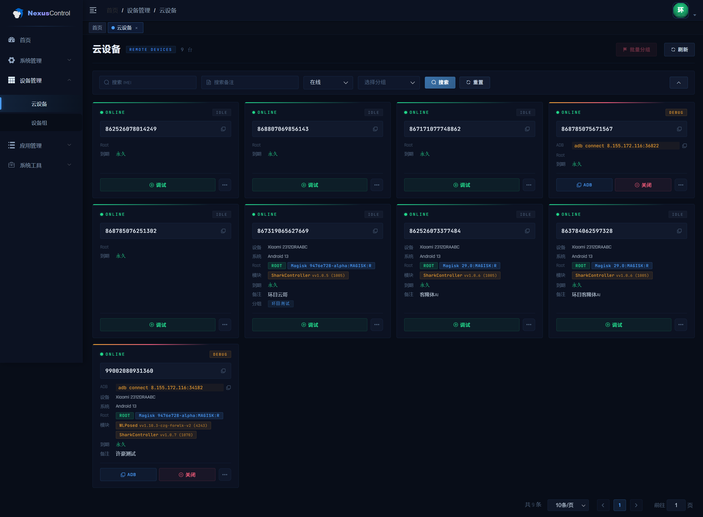

**路径：设备管理 → 云设备**

云设备是系统的核心功能页面，用于管理所有已接入的远程 Android 设备。页面默认只显示 **在线** 设备。

---

#### 搜索与筛选

页面顶部提供四个筛选条件，可组合使用：

| 条件 | 说明 |
|------|------|
| **搜索 IMEI** | 输入设备 IMEI 进行模糊查询 |
| **搜索备注** | 输入设备备注名进行模糊查询 |
| **在线状态** | 按在线 / 离线过滤，默认筛选「在线」 |
| **选择分组** | 按设备所属分组过滤 |

点击 **搜索** 执行查询，点击 **重置** 清空所有条件恢复默认。

---

#### 设备卡片说明

每台设备以卡片形式展示，卡片顶部色条反映当前调试状态：
- **绿色**：设备在线，空闲（IDLE）
- **蓝色**：设备在线，FRP 调试隧道已开启（DEBUG）
- **灰色**：设备离线

卡片内各字段说明（仅有数据时显示）：

| 字段 | 说明 |
|------|------|
| **ONLINE / OFFLINE** | 设备当前在线状态 |
| **DEBUG / IDLE** | 调试隧道状态，DEBUG 表示 FRP 已开启 |
| **IMEI** | 设备唯一标识号，右侧复制图标可一键复制 |
| **ADB** | DEBUG 状态下显示，格式：`adb connect <IP>:<端口>` |
| **设备** | 品牌 + 型号，如 `Xiaomi 2312DRAABC` |
| **系统** | Android 版本号 |
| **Root** | ROOT 状态及 Magisk 版本信息 |
| **模块** | 已安装的框架模块名称及版本（可有多个，如 SharkController + WLPosed） |
| **到期** | 设备授权到期时间，永久授权显示「永久」 |
| **备注** | 设备自定义备注名称 |
| **分组** | 设备所属分组标签 |

---

#### ADB 远程调试

> 通过 FRP 内网穿透将设备 ADB 端口映射到服务器，实现远程 ADB 连接。

**开启调试：**

1. 找到目标设备卡片（需处于 **ONLINE** 状态）
2. 点击卡片上的 **调试** 按钮，系统向设备下发指令，设备启动 FRP 隧道
3. 稍等片刻后点击 **刷新**，卡片顶部色条变蓝、状态变为 **DEBUG**，并显示 ADB 连接命令
4. 点击 **ADB** 按钮，一键复制命令到剪贴板
5. 在本机终端执行该命令，即可建立 ADB 连接

**关闭调试：**

- 调试完毕后点击 **关闭** 按钮，设备终止 FRP 隧道，状态恢复为 IDLE

---

#### 卡片右上角 ··· 菜单

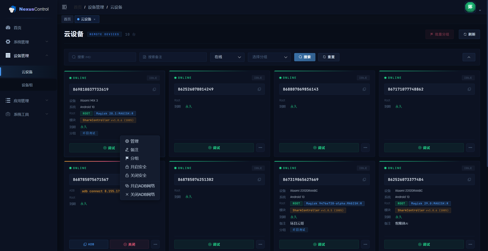

点击每张卡片右上角的 **···** 按钮，展开以下操作：

| 菜单项 | 说明 |
|------|------|
| **管理** | 进入设备详情页，查看完整设备信息、应用列表、模块管理、在线记录等 |
| **备注** | 弹出输入框，编辑该设备的自定义备注名称 |
| **分组** | 弹出分组选择器，将该设备加入指定设备组 |
| **开启安全** | 向设备下发开启安全模式指令 |
| **关闭安全** | 向设备下发关闭安全模式指令 |
| **开启ADB网络** | 开启设备的 ADB over Network（无线调试），开启后可通过网络直连 ADB |
| **关闭ADB网络** | 关闭设备的 ADB over Network |

---

#### 批量分组

1. 点击设备卡片的空白区域，卡片出现勾选状态
2. 勾选多台需要分组的设备
3. 点击页面顶部的 **批量分组** 按钮
4. 在弹出的分组选择器中选择目标分组，确认后批量生效

---

#### 设备详情页

点击 ··· → **管理** 进入某台设备的详情管理页，页面标题显示该设备的 IMEI 号，提供以下五个功能标签页：

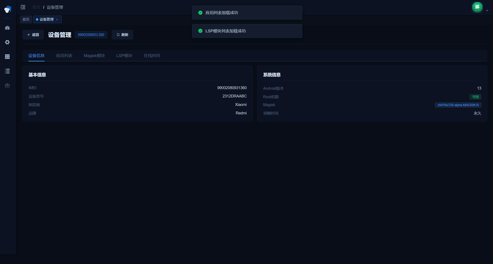

**① 设备信息**

展示设备的完整硬件与系统信息：

| 分组 | 字段 |
|------|------|
| **基本信息** | IMEI、设备型号、制造商、品牌 |
| **系统信息** | Android 版本、Root 权限状态、Magisk 版本、授权到期时间 |

---

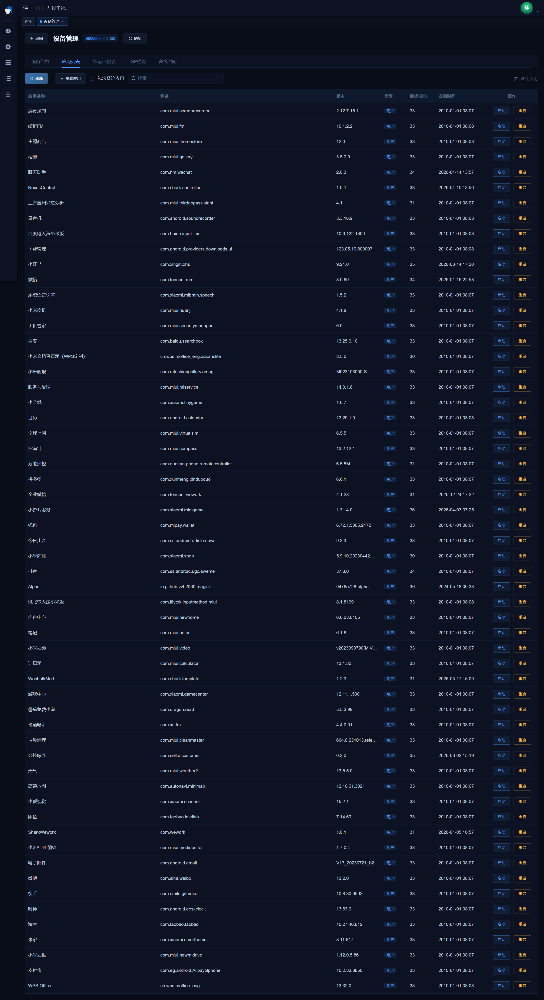

**② 应用列表**

列出该设备上已安装的所有应用，支持搜索和筛选：

- 勾选 **包含系统应用** 可显示系统内置 App
- 顶部搜索框支持按应用名称 / 包名模糊搜索
- 每条记录显示：应用名称、包名、版本号、类型（用户/系统）、目标 SDK、安装时间
- 每个应用提供两个操作按钮：
  - **启动**：远程向设备发送启动该应用的指令
  - **重启**：远程强制停止后重新启动该应用
- 点击 **安装应用** 可从应用中心选择一个 App 直接推送安装到此设备

---

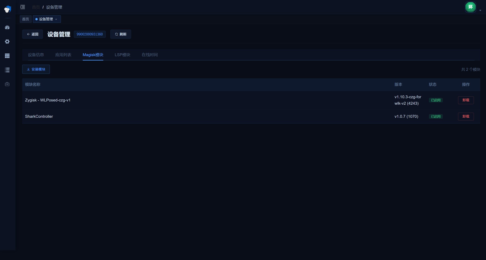

**③ Magisk 模块**

列出设备上已安装的所有 Magisk 模块（如 SharkController、WLPosed）：

| 字段 | 说明 |
|------|------|
| **模块名称** | Magisk 模块显示名称 |
| **版本** | 模块版本号及 Build 号 |
| **状态** | 已启用 / 已禁用 |

- 点击 **安装模块** 可推送新模块到设备安装
- 点击 **卸载** 可远程卸载指定模块

---

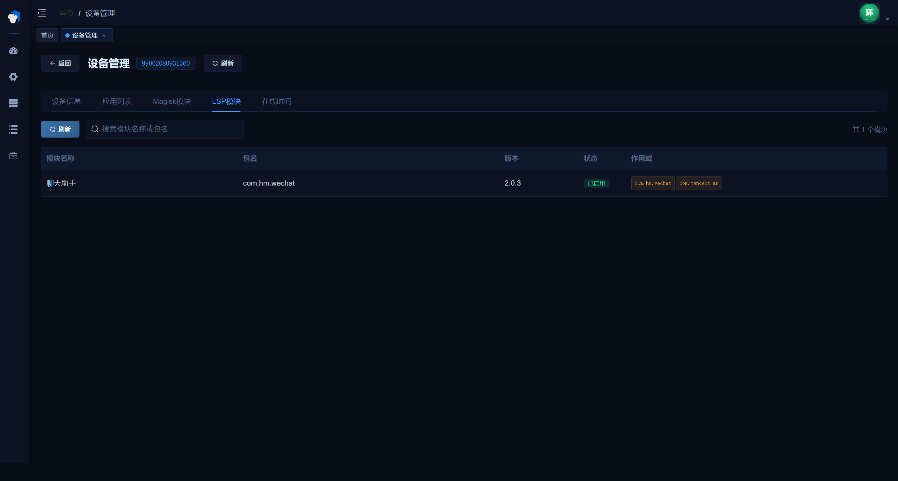

**④ LSP 模块**

列出通过 LSPosed / WLPosed 框架加载的 Xposed 模块：

| 字段 | 说明 |
|------|------|
| **模块名称** | Xposed 模块名称 |
| **包名** | 模块 APK 包名 |
| **版本** | 模块版本号 |
| **状态** | 已启用 / 已禁用 |
| **作用域** | 该模块注入的目标应用包名列表 |

支持按模块名称或包名搜索。

---

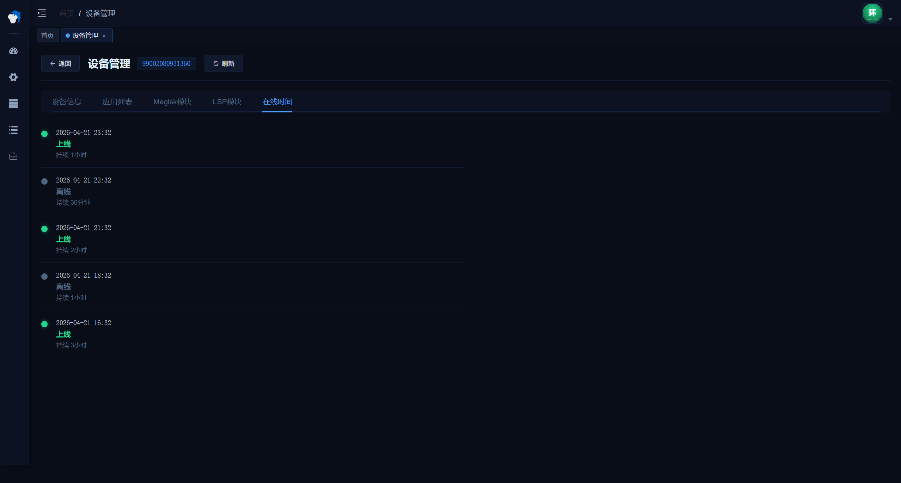

**⑤ 在线时间**

以时间轴形式记录设备的上线 / 离线历史：

- 每条记录显示：时间、状态（上线 / 离线）、持续时长
- 可直观了解设备的活跃时间段和离线规律

---

### 3.2 设备组

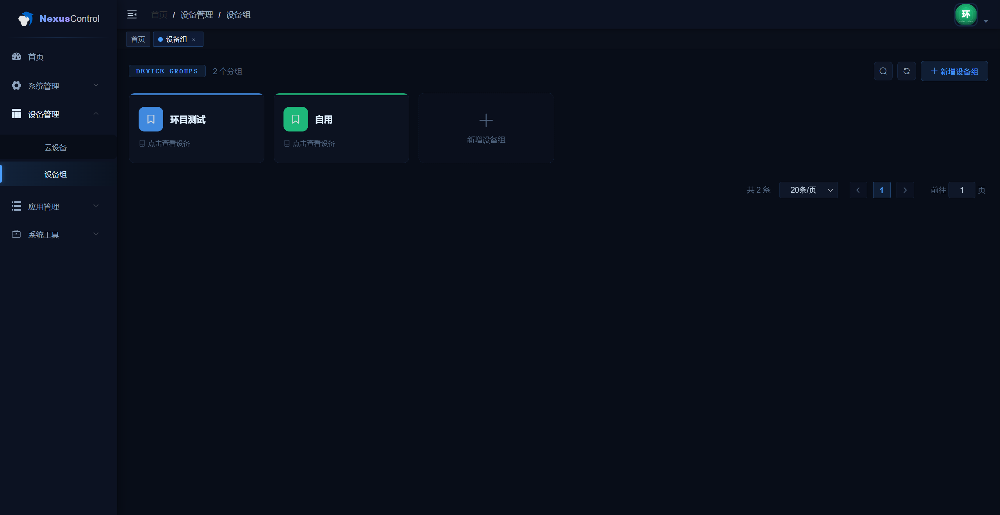

**路径：设备管理 → 设备组**

设备组用于对设备进行分类管理，便于批量操作和策略下发。

#### 功能说明

- 页面以卡片形式展示各设备分组，显示分组名称
- 点击分组卡片上的 **点击查看设备** 可查看该组下的设备列表
- 点击 **新增设备组** 按钮创建新分组，填写分组名称后保存

#### 操作

- **新增设备组**：创建新的设备分组
- 每个分组卡片右上角提供 **编辑**（铅笔图标）和 **删除**（垃圾桶图标）操作

---

## 4. 应用管理

### 4.1 App 包管理

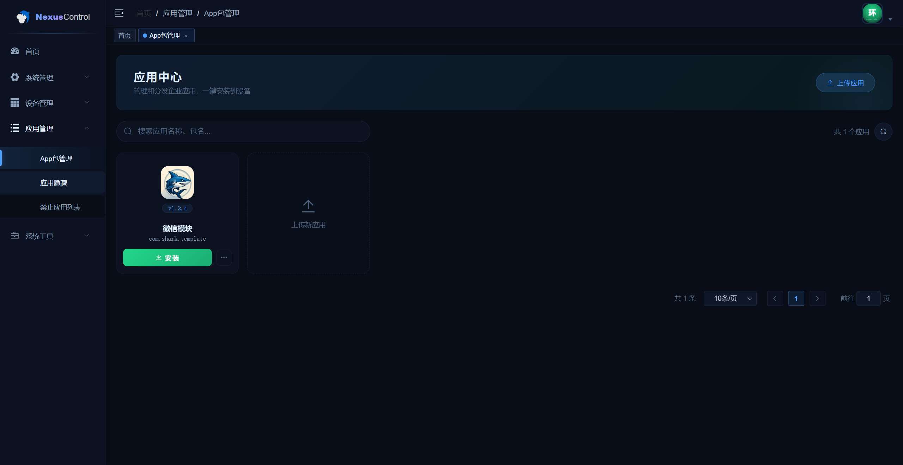

**路径：应用管理 → App包管理**

应用中心用于管理企业内部分发的 Android 应用安装包，支持一键推送安装到受控设备。

#### 功能说明

- 已上传的应用以卡片形式展示，包含版本号、应用名称和包名
- 点击 **安装** 按钮将弹出设备选择器，选择目标设备后推送安装
- 点击 **···** 展开更多操作（编辑、删除等）

#### 上传应用

1. 点击页面右上角 **上传应用** 按钮，弹出上传对话框
2. 将 APK 文件**拖拽**到上传区域，或点击 **点击选择** 从本地选取（仅支持 `.apk` 格式）
3. 文件上传后系统自动解析 APK 内容，并填充以下字段：

   | 字段 | 说明 |
   |------|------|
   | **图标** | 从 APK 中提取的应用图标 |
   | **名称** | 应用名称（自动填充，**可手动修改**） |
   | **包名** | APK 包名，自动读取，只读不可修改 |
   | **版本** | 版本名称及 Build 号，自动读取，只读 |

4. 确认信息无误后点击 **确 定** 保存，应用将出现在列表中

> APK 文件直接上传至云存储（OSS），上传期间可查看实时进度百分比。若需更换文件，点击 **重新选择** 即可。

#### 安装应用到设备

1. 找到目标应用卡片，点击 **安装** 按钮
2. 弹出设备选择对话框，提供两种选择方式：
   - **设备** 标签页：勾选单台或多台设备（默认只显示在线设备）
   - **设备组** 标签页：勾选整个设备分组，批量下发
3. 选择完成后点击 **确认安装**，系统向所选设备推送安装指令

#### 搜索

在顶部搜索框输入应用名称或包名，快速定位目标应用。

---

## 5. 系统管理

### 5.1 核心管理

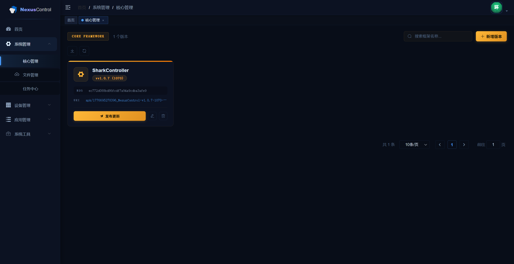

**路径：系统管理 → 核心管理**

核心管理用于维护推送到设备端的 **Zygisk 框架模块包**（SharkController），设备通过该模块实现底层控制能力。

#### 框架卡片信息

| 字段 | 说明 |
|------|------|
| **框架名称** | Zygisk 模块包名称（如 SharkController） |
| **版本号** | 当前版本，如 `vv1.0.7 (1070)` |
| **MD5** | 文件完整性校验码 |
| **URI** | 文件存储路径/下载地址 |

#### 操作

| 按钮 | 说明 |
|------|------|
| **新增版本** | 上传新版本的 Zygisk 框架包 |
| **发布更新** | 向在线设备下发更新指令，设备收到后自动拉取新版框架 |
| **编辑**（铅笔图标） | 修改框架包信息 |
| **删除**（垃圾桶图标） | 删除该版本记录 |

> **注意**：点击发布更新后，弹出设备选择器（默认只显示在线设备），确认选择后在线设备将收到升级推送，请确认版本无误后再操作。

---

### 5.2 任务中心

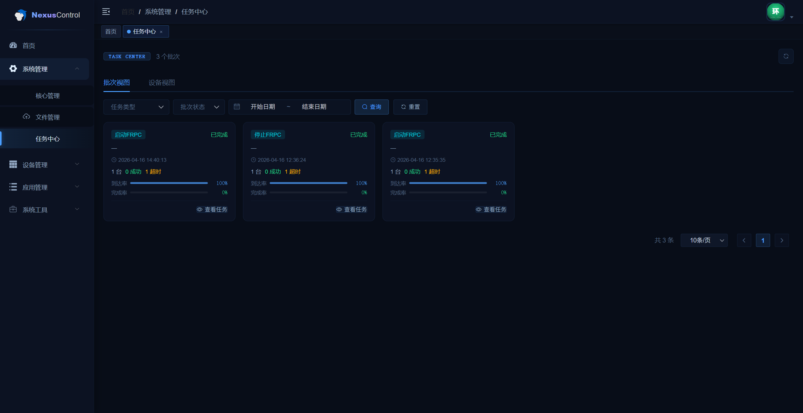

**路径：系统管理 → 任务中心**

任务中心用于查看系统向设备下发的各类指令任务的执行情况，支持批次维度和设备维度两种视图。

#### 视图切换

- **批次视图**（默认）：以一次下发操作为一个批次，显示该批次的整体执行统计
- **设备视图**：以单台设备为单位，查看每台设备的任务执行结果

#### 批次卡片信息

| 字段 | 说明 |
|------|------|
| **任务类型** | 如：启动FRPC / 停止FRPC / 安装应用 / 重启应用等 |
| **批次状态** | 进行中 / 已完成 |
| **执行时间** | 任务下发时间 |
| **设备数量** | 本批次包含的设备总数 |
| **成功 / 超时** | 执行成功和超时的设备数量 |
| **到达率** | 指令成功下达设备的比例 |
| **完成率** | 设备成功执行完成的比例 |

#### 搜索筛选

- 按 **任务类型** 筛选
- 按 **批次状态** 筛选（进行中 / 已完成）
- 按 **日期范围** 筛选

#### 操作

- **查看任务**：展开该批次下各设备的详细执行记录

---

*本手册根据 NexusControl 系统实际页面采集整理 · 2026-04-22*

---

## 联系我们

如有使用问题或合作咨询，欢迎通过以下方式联系：

| 渠道 | 联系方式 |
|------|------|
| **QQ** | 1243596620 |
